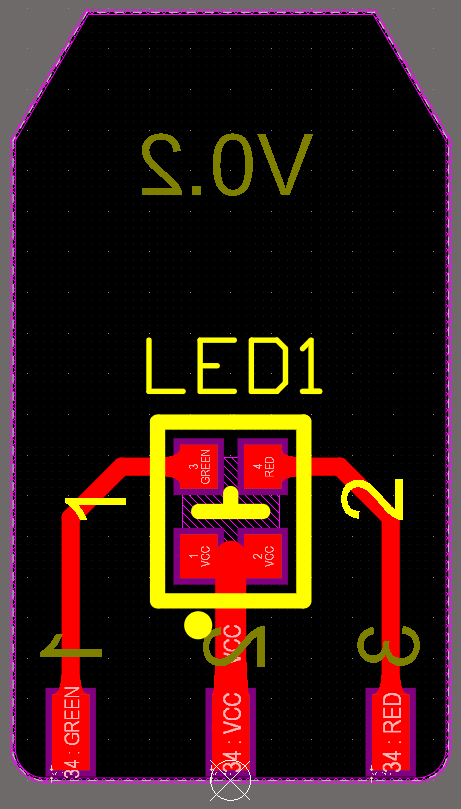
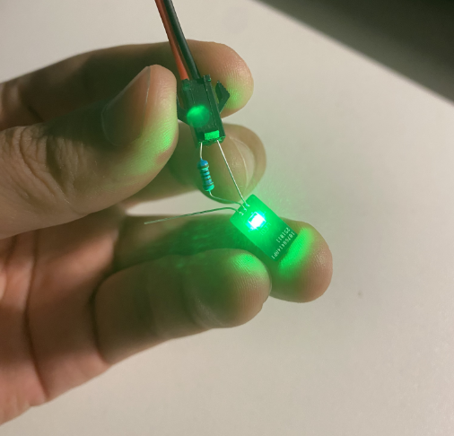
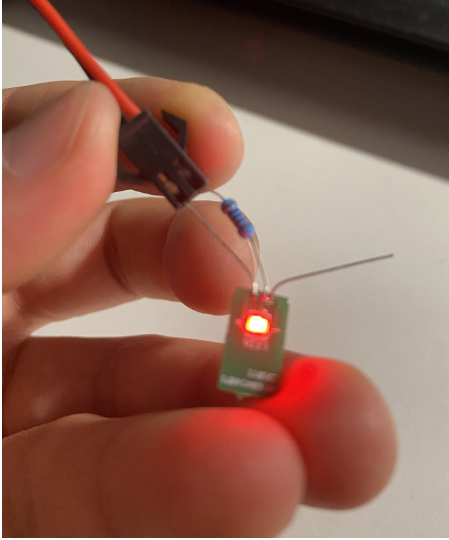
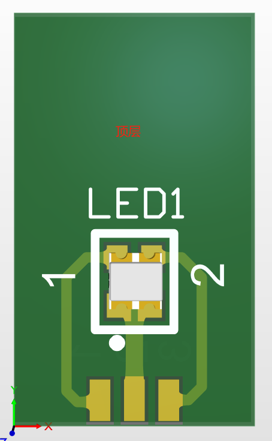
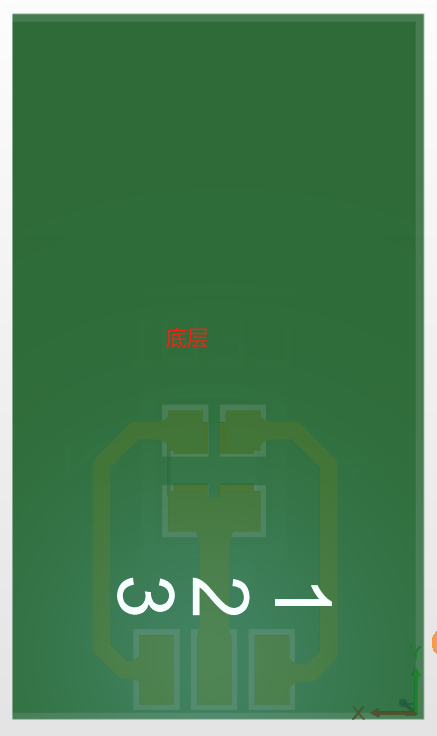

# 小灯板日志

## 2025.11.03

- 小灯板V0.2：1、宽度改成6.8mm（现在是6.8*12mm）； 2 LED的PAD由原来间距1mm，改为了2.5mm（如图）； 3 、矩形框四脚下方半圆弧倒角半径0.5mm，上方30度锐角（具体见板框图）；4、增加版本号V0.2；`5、LED灯与最初设计要求下移了0.5mm，修改第二版时发现，但对方未提及修改，未作改动`；6、V0.2下单100片。
- 

## 2025.10.26

- 小灯板总结：1、串联1K电阻至正极中，如果要调节红灯和绿灯亮度，需要在负极各串联合适电阻，改变亮度；2、施加5V电压，结果如下图。
- 
- 

## 2025.10.24

- 小灯板总结：1、v1.0版本如下图所示；2、如需改进，可以修改焊盘间距及大小，或者改为孔。
- 
- 
